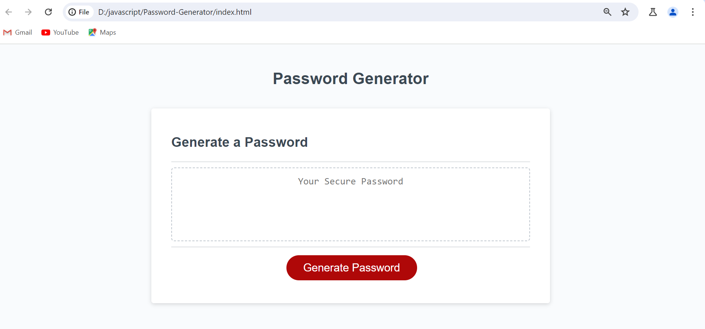
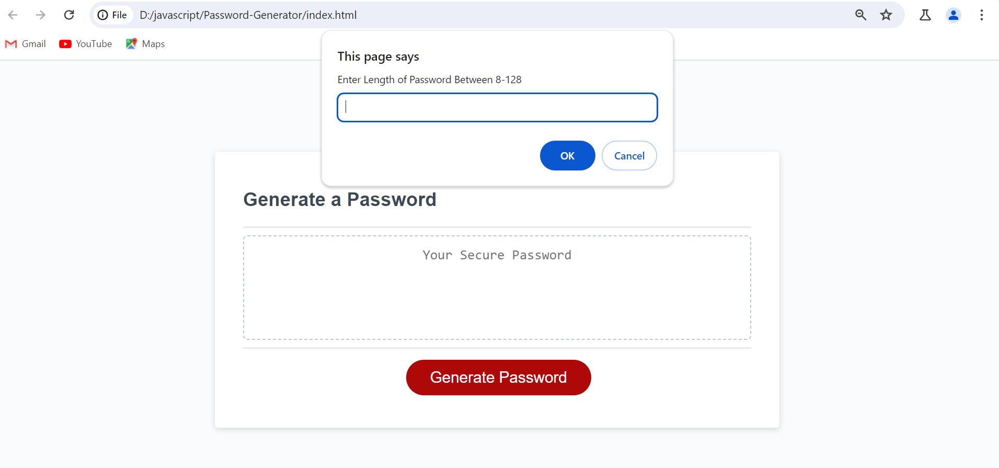
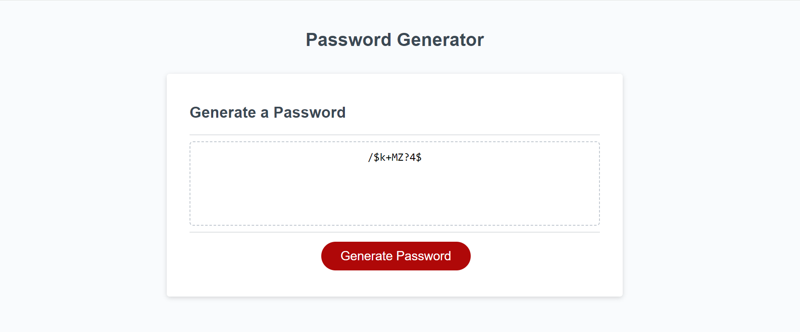

# Password-Generator

## Description
The Password Generator is a web-based utility that empowers users to create secure and customizable passwords tailored to their specific requirements. This tool offers flexibility in password generation by allowing users to determine the length of their passwords and select the types of characters to include, such as lowercase letters, uppercase letters, numbers, and special characters.

## Installation
Open a terminal or command prompt and run the following command to clone the repository to your local machine: git clone https://github.com/jeylanab/password-generator.git,
Navigate to the project directory using the cd command:  "cd password-generator".
Finally, Open the index.html file in your preferred web browser. You can do this by double-clicking the file or using a command like.

## Usage
1) Open the web page in your browser.
2) Click the "Generate Password" button.
3) Follow the prompts to customize your password.
4) Click the "Copy" button to copy the generated password to your clipboard.

## Credits
YouTube, Search Engine and other resource

## License
This project is licensed under the MIT License.
